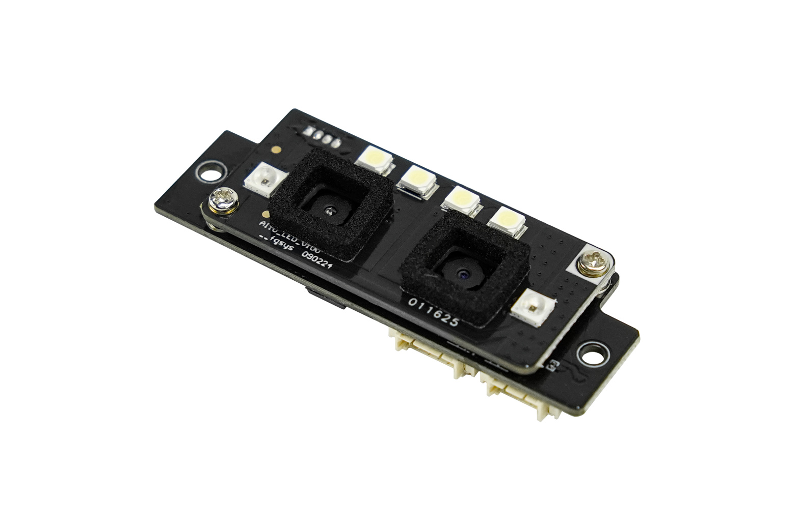

# DFRobot_AI10
- [English Version](./README.md)

这是一款高精度AI视觉识别模组，采用双200万像素摄像头配合先进的深度学习算法，具有动静目标均可精准识别的特点。相比传统视觉传感器，其抗干扰能力显著提升，不受环境光照变化、温度波动或复杂背景等因素影响。无论是快速移动的人体、静态人脸还是细微的掌静脉特征，模组都能实现快速、稳定的检测识别。
以智能楼宇门禁系统为例，传统方案在逆光、暗光或人员密集场景下容易出现识别失败。而本AI视觉模组凭借强大的环境适应能力，可在各种复杂光照条件下准确识别人脸、掌纹等生物特征，同时支持多人同时检测。其毫秒级响应速度确保通行效率，内置的3D活体检测功能有效防范照片、视频等欺骗手段，为智能安防系统提供更可靠的身份认证解决方案。该模组还能实时统计人员进出数据，助力楼宇实现智能化管理和资源优化配置。




## 产品链接(https://www.dfrobot.com.cn/goods-4181.html)

    SKU：SEN0677

## 目录

* [概述](#概述)
* [库安装](#库安装)
* [方法](#方法)
* [兼容性](#兼容性y)
* [历史](#历史)
* [创作者](#创作者)

## 概述

提供一个Arduino库，此库具有以下功能：
  识别 人脸或掌纹
  获取 二维码信息

## 库安装
这里提供两种使用本库的方法：<br>
1.打开Arduino IDE,在状态栏中的Tools--->Manager Libraries 搜索"DFRobot_AI10"并安装本库.<br>
2.首先下载库文件,将其粘贴到\Arduino\libraries目录中,然后打开examples文件夹并在该文件夹中运行演示.<br>

## 方法

```C++
 /**
   * @fn enrollUser
   * @brief 登记面部或手掌信息注册用户
   * @param admin
   * @n      eNormal     普通权限
   * @n      eAdmin:     管理员权限
   * @param userName   注册用户名
   * @param timeout    超时时间(单位:秒)
   * @return userData_t
   * @n       UID                    用户ID
   * @n       userName               用户名
   * @n       admin                  用户权限
   * @n       type                   登记类型
   * @n        eNull                    空
   * @n        eFace                    面部
   * @n        ePalm                    掌纹
   * @n       result                 注册结果
   * @n         eSuccess                成功
   * @n         eFailedFaceEnrolled     注册失败，已存在该用户
   * @n         eFailedInvalidParam     无效参数
   * @n         eFailedMaxUser          以达到最大用户数量
   * @n         eFailedCamera           相机故障
   * @n         eFailedTimeout          超时
   * @
  */
  sUserData_t enrollUser(uint8_t admin,const char* userName, uint8_t timeout);

  /**
   * @fn getAllUserIDs
   * @brief 获取所有用户信息
   * @return sAllUserID_t
   * @n       result    获取结果s
   * @n         0        成功
   * @n         default  失败
   * @n       userNum   用户数量
   * @n       UIDS      所有用户ID
  */
  sAllUserID_t getAllUserIDs(void);

  /**
   * @fn enableFaceFrame
   * @brief 使能面部框
   * @return true or false
  */
  bool enableFaceFrame(void);

  /**
   * @fn getRecognitionResult
   * @brief 连续识别结果
   * @param timeout 超时时间(单位:秒)
   * @return sRecognitionData_t
   * @n       result    识别结果
   * @n       userData  用户信息
   * @n       noteData  备注信息
   * @n       QRDdata   二维码信息
   * @n       type      识别类型
   * @n        eNull     空
   * @n        eFace      面部
   * @n        ePalm      掌纹
   * @n        eQR       二维码
  */
  sRecognitionData_t getRecognitionResult(uint8_t timeout);

  /**
   * @fn startContinuousFaceRecognition
   * @brief 开始面部识别（连续识别）
   * @param timeout 超时时间(单位:秒)
   * @return sRcognitionData_t
   * @n       result    成功:0,其他:失败
   * @n       userData  用户信息
   * @n       noteData
   * @n       QRDdata   二维码数据
   * @n       type      识别类型
   * @n        eNull     空
   * @n        eFace     面部
   * @n        ePalm     掌纹
   * @n        eQR       二维码
  */
  sRcognitionData_t startContinuousFaceRecognition(uint8_t timeout);

  /**
   * @fn deleteUser
   * @brief 删除指定用户
   * @param UID
   * @return true or false
  */
  bool deleteUser(uint16_t UID);

  /**
   * @fn deleteAllUser
   * @brief 删除所有用户
   * @return true or false
  */
  bool deleteAllUser(void);
```

## 兼容性

MCU                | Work Well    |   Work Wrong    | Untested    | Remarks
------------------ | :----------: | :-------------: | :---------: | :----:
Arduino Uno        |      √       |                 |             |
Arduino MEGA2560   |      √       |                 |             |
Arduino Leonardo   |      √       |                 |             |
FireBeetle-ESP8266 |      √       |                 |             |
FireBeetle-ESP32   |      √       |                 |             |
FireBeetle-M0      |      √       |                 |             |
Micro:bit          |              | nonsupport uart |             |

## 历史
- 2025/07/18 - V1.0.0 版本

## 创作者

Written by zhixinliu(zhixinliu@dfrobot.com), 2025. (Welcome to our [website](https://www.dfrobot.com/))
