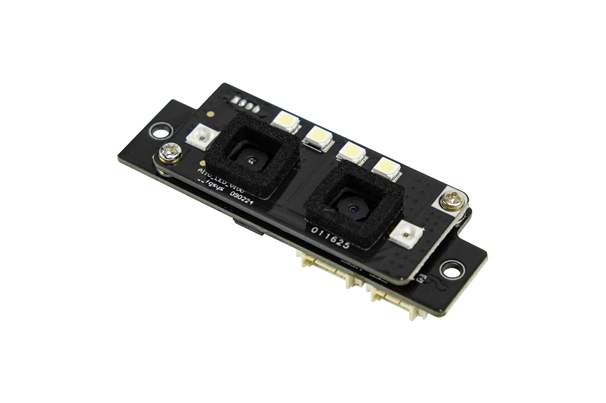

# DFRobot_AI10
- [中文版](./README_CN.md)

This is a high-precision AI visual recognition module, featuring dual 2-megapixel cameras in combination with advanced deep learning algorithms. It is capable of accurately identifying both moving and static targets. Compared with traditional visual sensors, its anti-interference ability has been significantly enhanced and it is not affected by factors such as changes in environmental light, temperature fluctuations or complex backgrounds. Whether it is a fast-moving human body, a static human face or subtle palm vein features, the module can achieve rapid and stable detection and recognition.



## Product Link(https://www.dfrobot.com/product-2972.html)

    SKU：SEN0677

## Table of Contents

* [Summary](#Summary)
* [Installation](#Installation)
* [Methods](#Methods)
* [Compatibility](#Compatibility)
* [History](#History)
* [Credits](#Credits)

## Summary

Provides an Arduino library that has the following features:
  Recognize human faces or palm prints
  Obtain the QR code information


## Installation
1. Download the library to Raspberry Pi first before use.

```
sudo git clone https://github.com/DFRobot/DFRobot_AI10
```

1. Open and run the routine. To execute a routine demo_x.py, enter python demo_x.py in the command line. For example, to execute the routine continuous_recognition.py, you need to enter:

```
python  continuous_recognition.py
or
python2 continuous_recognition.py
or
python3 continuous_recognition.py
```

## Methods

```python
  def begin(self):
  '''!
    @brief begin
  '''

  def start_continuous_face_recognition(self,timeout):
    '''!
      @brief Start continuous face recognition
      @param timeout: Timeout time (3-20s)
      @return recognize the result
      @n      result        Instruction execution result
      @retval  0x00:        Recognition success
      @retval  default:     Recognition failure
      @n      type:         Recognition types
      @retval  TYPE_NULL:   Undefine
      @retval  TYPE_FACE:   Face recognition
      @retval  TYPE_PALM:   Palm recognition
      @retval  TYPE_QR:     QR code recognition
      @n      uid:          user ID
      @n      user_name     Recognition user name
      @n      admin:        Recognition user permissions
      @retval  NORMAL:      Normal user
      @retval  ADMIN:       Admin user
      @n      QR_date:      The QR code data
    '''

  def get_recognition_result(self,timeout):
    '''!
      @brief Recognize once at a time
      @param timeout: Timeout time (3-20s)
      @return recognize the result
      @n      result        Instruction execution result
      @retval  0x00:        Recognition success
      @retval  default:     Recognition failure
      @n      type:         Recognition types
      @retval  TYPE_NULL:   Undefine
      @retval  TYPE_FACE:   Face recognition
      @retval  TYPE_PALM:   Palm recognition
      @retval  TYPE_QR:     QR code recognition
      @n      uid:          user ID
      @n      user_name     Recognition user name
      @n      admin:        Recognition user permissions
      @retval  NORMAL:      Normal user
      @retval  ADMIN:       Admin user
      @n      QR_date:      The QR code data
    '''

  def enable_face_frame(self):
    '''!
      @brief Enable face frame
      @return enable the face frame result
      @retval      True  enable the face frame success
      @retval      False  enable the face frame failure
    '''

  def get_all_user_ids(self):
    '''!
      @brief Get all user ID
      @return Get the result
      @n      result      Instruction execution result
      @retval  0x00:       Get all user ID success
      @retval  default:    Get all user ID failure
      @n      user_num:   The number of users
      @n      uids:       The user ID list
    '''

  def get_user_info(self,uid):
    '''!
      @brief get_user_info
      @param uid: The user ID
      @return struct_recv_pack
      @n      result      0 means success, default failure
      @n      uid:        user ID
      @n      user_name   user name
      @n      admin:      User enrollment permissions
      @n      type:       User enrollment type
    '''

  def delete_user(self,uid):
    '''!
      @brief Delete user
      @param uid: The user ID
      @return delete the user result
      @retval  True: delete the user success
      @retval  False: delete the user failure
    '''

  def delete_all_user(self):
    '''!
      @brief Delete all user
      @return delete all user result
      @retval  True: delete the user success
      @retval  False: delete the user failure
    '''

  def enroll_user(self,admin,user_name,timeout):
    '''!
      @brief Enroll user
      @param admin: The user is an administrator or not
      @retval NORMAL:     Normal user
      @retval ADMIN:      Admin user
      @param user_name: The user name
      @param timeout: Timeout time, measured in seconds(3-20s)
      @return enroll the user result
      @n      uid:                  The user ID
      @n      user_name             The user name
      @n      admin:                User enrollment permissions
      @retval  NORMAL:              Normal user
      @retval  ADMIN:               Admin user
      @n      type:                 User enrollment type
      @retval  TYPE_NULL:           Undefine
      @retval  TYPE_FACE:           Face enrollment
      @retval  TYPE_PALM:           Palm enrollment
      @n      result                Instruction execution result
      @retval  Success:             Enroll user success
      @retval  FailedFaceEnrolled:  Failed to enroll user due to face recognition failure
      @retval  default:             Enroll user failure
    '''
```

## 兼容性

* RaspberryPi Version

| Board        | Work Well | Work Wrong | Untested | Remarks |
| ------------ | :-------: | :--------: | :------: | ------- |
| RaspberryPi2 |           |            |    √     |         |
| RaspberryPi3 |           |            |    √     |         |
| RaspberryPi4 |     √     |            |          |         |

* Python Version

| Python  | Work Well | Work Wrong | Untested | Remarks |
| ------- | :-------: | :--------: | :------: | ------- |
| Python2 |     √     |            |          |         |
| Python3 |     √     |            |          |         |


## 历史

- 2025/07/18 - Version 1.0.0 released.

## 创作者

Written by jiali(zhixinliu@dfrobot.com), 2025. (Welcome to our [website](https://www.dfrobot.com/))
